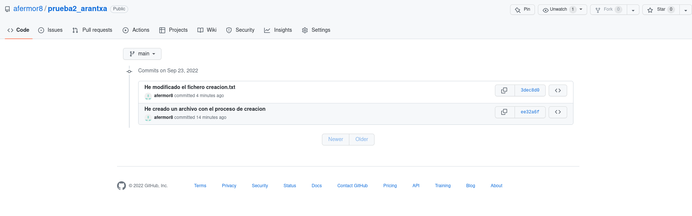

# Git y Github
## Creación de un repositorio local

Para crear un *repositorio local* en **git** he realizado los siguientes pasos:

1. En la terminal linux con el comando `git init <nombre_repositorio>` creo un repositorio:

`arantxa@debian:~$ git init prueba2_arantxa`

2. En este repositorio he creado un fichero llamado *creacion.txt*.

`arantxa@debian:~$ cd prueba2_arantxa/`

`arantxa@debian:~/prueba2_arantxa$ nano creacion.txt`

`arantxa@debian:~/prueba2_arantxa$ git add .`

`arantxa@debian:~/prueba2_arantxa$ git commit -m "He creado el fichero creacion.txt"`

3. Creo un repositorio en **Github** con el mismo nombre (prueba2_arantxa) y realizo los siguientes pasos:

`arantxa@debian:~/prueba2_arantxa$ git branch -M main`

`arantxa@debian:~/prueba2_arantxa$ git remote add origin git@github.com:afermor8/prueba2_arantxa.git`

`arantxa@debian:~/prueba2_arantxa$ git push -u origin main`

Y ya estaría creado en **Github** sincronizado con el *repositorio local*.

Enlaces:
- Click [aquí](https://github.com/afermor8/prueba2_arantxa) para ir al enlace del repositorio creado en Github.
- En este [enlace](markdown2.md) podemos ver otro fichero tipo markdown. 

| **VENTAJAS** | **DESVENTAJAS** |
|--------------|-----------------|
| Integridad de la información | Aprendizaje |
| Velocidad |
| Ramificación |
| Flujo de trabajo adaptable |
| Seguridad |
| Coste |
